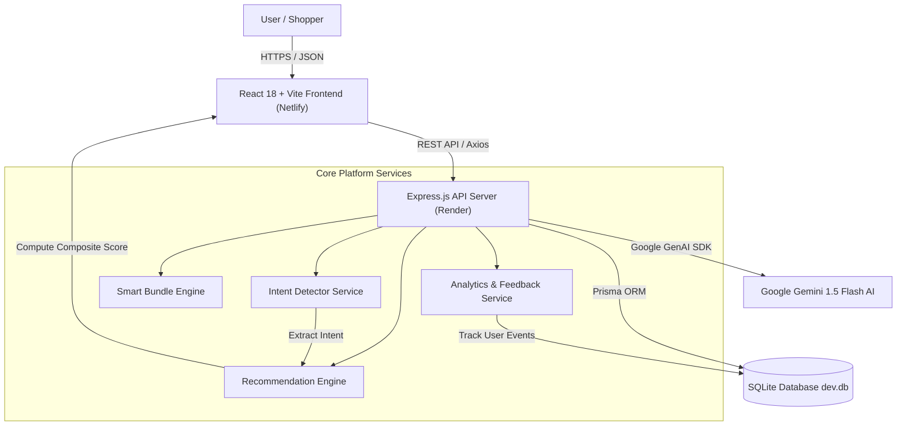
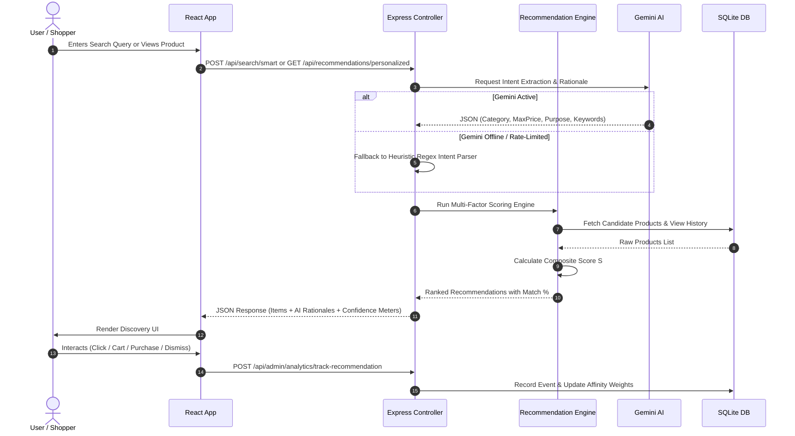

# 🧠 AI Discovery Engine

[](https://react.dev/)
[](https://nodejs.org/)
[](https://expressjs.com/)
[](https://www.prisma.io/)
[](https://www.sqlite.org/)
[](https://ai.google.dev/)
[](https://www.netlify.com/)
[](https://render.com/)
[](LICENSE)
[](#-hackathon-information)

An AI-powered product discovery and personalized recommendation platform that transforms static keyword search into a real-time, intent-aware shopping experience. Built with React, Lenis Smooth Scroll, Express.js, Prisma ORM, and Google Gemini AI.

---

## 🌐 Live Production Deployments

| Component | Deployment Platform | Deployment Target & Status |
|---|---|---|
| **Frontend UI** | **Netlify** | Deployed on Netlify (`Base: frontend`, `Build: npm run build`, `Publish: dist`) |
| **Backend REST API** | **Render** | Deployed on Render Web Service (`Root: backend`, `Build: npm install && npx prisma generate`) |
| **API Health Check** | **Render** | `GET /api/health` — Returns status `200 OK` JSON |

---

## 🎯 Project Objective

Traditional e-commerce platforms rely heavily on exact keyword matching. When shoppers enter natural language queries like *"lightweight laptop for coding and video editing under ₹100,000"* or *"gaming setup for immersive audio"*, keyword search engines often return irrelevant results or empty pages.

**AI Discovery Engine** solves this by:
1. **Understanding Natural Language Intent**: Parsing intent tags, budget caps, target categories, and specifications using **Google Gemini 1.5 Flash**.
2. **Transparent Explainable AI**: Providing multi-metric confidence scores (Confidence %, Attribute Similarity %, Category Match %) alongside human-readable rationales.
3. **Smart Ecosystem Bundling**: Assembling complementary 4-piece product ecosystems (*Complete The Look*) and Amazon-style *Frequently Bought Together* widgets with 1-click cart addition.
4. **Never-Empty Cold Start Guarantee**: Ensuring new or unauthenticated users immediately receive high-affinity trending and popular catalog items.
5. **Fluid Cybernetic UI**: Built with custom glassmorphism 3.0, ambient radial mesh lighting, and **Lenis inertia smooth scrolling**.

---

## 🏆 Hackathon Information

This project was developed for **AI BUILD 2026**:
- **Event**: AI BUILD 2026
- **Track**: **Track 7 – Discovery Engine**
- **Focus Area**: Personalized Multi-Intent Product Recommendations & Discovery

---

## 🏗️ System Architecture



---

## ⚙️ Recommendation & Scoring Engine Workflow

Candidates are evaluated through a **Multi-Factor Scoring Formula** generating a composite score $S \in [0, 100]$:

$$S = (0.35 \times S_{\text{intent}}) + (0.25 \times S_{\text{sim}}) + (0.20 \times S_{\text{cat}}) + (0.10 \times S_{\text{brand}}) + (0.10 \times S_{\text{pop}})$$

> *Note: The weights are heuristic values chosen for this prototype to prioritize real-time user intent. In a production environment these weights would be optimized using historical user interactions, offline evaluation and A/B testing.*



---

## 🌟 Features Overview

### 🧠 AI & Recommendation Features
- **Natural Language Intent Parsing**: Concurrently extracts intent tags, budget caps, category constraints, and brand preferences.
- **Cold-Start Fallback Guarantee**: Gracefully transitions new visitors to high-velocity trending items when explicit history is absent.
- **Explainable AI Confidence Meters**: Visual multi-bar display showing **Confidence %**, **Attribute Similarity Score %**, and **Category Match Score %**.
- **Smart Ecosystem Bundles**:
  - *Frequently Bought Together*: Interactive Amazon-style checkboxes with bundled price calculations and 1-click cart addition.
  - *Complete The Look*: Curated 4-piece ecosystem package showcase offering package discount savings.
- **Gemini Shopper Intelligence**: Profile-level shopper personality summary generated on the User Profile dashboard.

### 🛒 Shopping Experience Features
- **Lenis Smooth Scroll Engine**: Integrated Lenis smooth scrolling for fluid inertia-driven page navigation.
- **Command-K Spotlight AI Search**: Overlay command-palette modal with interactive quick-prompt shortcuts, Gemini thinking animation, and intent breakdown chips.
- **Apple Store / Vercel Style Glass Cards**: Glassmorphism 3.0 styling, smooth image scale hover (`scale(1.08)`), micro-shadows, and elegant AI rationale badges.
- **Interactive Product Details**: Multi-image preview gallery with hover zoom, technical specification tables, glass AI rationale cards, and horizontal snap-scroll carousels.
- **Streamlined Checkout Flow**: Delivery address form, order summary sidebar, default *Cash on Delivery* payment option, and order success confirmation page with estimated delivery dates.

### 📊 Admin & Analytics Features
- **Management Dashboard**: Overview KPIs (*Users, Revenue, Orders, Active Products*).
- **Search Analytics**: Top searched terms bar chart, zero-inventory demand alerts, search conversion %, AI usage %, and response latency metrics.
- **Customer Journey Funnel**: 6-stage conversion tracking (`Home → Search → Product View → Wishlist → Cart → Purchase`) with drop-off percentages.
- **Recommendation Feedback Loop**: Real-time tracking of recommendation events (`SHOWN`, `CLICKED`, `CARTED`, `PURCHASED`, `DISMISSED`) and CTR % metrics.
- **Catalog Management (CRUD)**: Modal interface for admins to create, edit, or remove catalog items cleanly.

### 🔒 Infrastructure & Deployment Features
- **Netlify & Render Ready**: Configured CORS origin matching (`FRONTEND_URL`), SPA redirects (`_redirects` & `netlify.toml`), and automatic Prisma client generation.
- **Authentication & Authorization**: Stateless JWT authentication with BCrypt password hashing and Role-Based Access Control (`CUSTOMER` vs `ADMIN`).
- **Silent Heuristic Failover**: Zero downtime fallback logic ensuring full application functionality even if third-party AI APIs are unreachable.

---

## 🛠️ Technology Stack

| Layer | Technology | Usage in Project |
|---|---|---|
| **Frontend Framework** | **React 18.3** | Component-driven user interface |
| **Smooth Scroll** | **Lenis 1.3** | Inertia-driven smooth scrolling engine |
| **Build Tool** | **Vite 5.4** | High-speed ESM bundler and HMR server |
| **Routing** | **React Router DOM 6.22** | Client-side page navigation & protected routes |
| **Styling** | **Vanilla CSS Tokens** | Custom design system (`index.css`) with glassmorphism 3.0 |
| **Data Visualization** | **Recharts 2.12** | Analytics charts & funnel visualizations |
| **Icons** | **Lucide React 0.359** | Modern vector icon system |
| **Backend Runtime** | **Node.js v18+** | Server-side JavaScript environment |
| **Web Framework** | **Express.js 4.19** | REST API routing and middleware pipeline |
| **Database & ORM** | **Prisma ORM 5.10 + SQLite** | Type-safe schema definition and query builder |
| **Artificial Intelligence** | **Google Gemini 1.5 Flash SDK** | `@google/generative-ai` natural language intent parsing |
| **Hosting & Deployment** | **Netlify & Render** | Deployed frontend static site and backend API service |

---

## 📁 Folder Structure

```
Discovery Engine/
├── docs/
│   └── screenshots/              # Real application screenshots
├── backend/
│   ├── prisma/
│   │   ├── schema.prisma         # Database schemas & relationship definitions
│   │   ├── dev.db                # SQLite database file
│   │   └── seed.js               # Data seeder (18 tech products across 8 flagship brands)
│   ├── src/
│   │   ├── ai/
│   │   │   └── geminiService.js  # Gemini 1.5 Flash AI Intent Parser & Rationale Generator
│   │   ├── config/               # Environment variables & DB client setup
│   │   ├── controllers/          # Request handlers for Auth, Products, Search, Recs, Cart, Orders, Admin
│   │   ├── middleware/           # Auth JWT, RBAC, and centralized Error Handler
│   │   ├── routes/               # Express API route declarations
│   │   ├── services/             # IntentDetector, RecommendationEngine, BundleEngine, AnalyticsService
│   │   └── server.js             # Express server entry point
│   ├── .env.example
│   └── package.json
│
├── frontend/
│   ├── src/
│   │   ├── components/           # AIConfidenceMeter, AISearchModal, FrequentlyBoughtTogether, CompleteTheLookBundle, Navbar, Footer
│   │   ├── context/              # AuthContext, CartContext, WishlistContext, ThemeContext
│   │   ├── pages/                # Home, Browse, ProductDetail, CartPage, CheckoutPage, OrderSuccessPage, UserProfilePage, AdminDashboard
│   │   ├── services/             # Axios API client configuration
│   │   ├── App.jsx               # Main router, Lenis provider & wrapper
│   │   ├── index.css             # Design tokens, mesh gradients & keyframe animations
│   │   └── main.jsx              # React entry point
│   ├── .env.example
│   ├── index.html
│   ├── vite.config.js
│   └── package.json
├── netlify.toml
├── LICENSE
├── README.md
└── .gitignore
```

---

## 🚀 Deployment Guide & Environment Variables

### 1. Render Deployment (Backend Web Service)
- **Root Directory**: `backend`
- **Build Command**: `npm install && npx prisma generate`
- **Start Command**: `npm start`
- **Environment Variables**:
  ```env
  PORT=5000
  NODE_ENV=production
  DATABASE_URL=file:./dev.db
  JWT_SECRET=your-secure-jwt-secret
  GEMINI_API_KEY=your-google-gemini-api-key
  FRONTEND_URL=https://your-netlify-app.netlify.app
  ```

### 2. Netlify Deployment (Frontend React App)
- **Base Directory**: `frontend`
- **Build Command**: `npm run build`
- **Publish Directory**: `dist`
- **Environment Variables**:
  ```env
  VITE_API_URL=https://your-render-backend.onrender.com/api
  ```

---

## 📡 API Reference

### Health & Status
| Method | Endpoint | Access | Description |
|---|---|---|---|
| `GET` | `/` | Public | Server API Root Welcome status |
| `GET` | `/api/health` | Public | Render Health Check endpoint (200 OK) |

### Authentication
| Method | Endpoint | Access | Description |
|---|---|---|---|
| `POST` | `/api/auth/register` | Public | Register a new customer account |
| `POST` | `/api/auth/login` | Public | Authenticate user and receive JWT token |
| `GET` | `/api/auth/me` | Protected | Fetch current logged-in user profile |

### Products & Categories
| Method | Endpoint | Access | Description |
|---|---|---|---|
| `GET` | `/api/products` | Public | Filter and sort catalog products |
| `GET` | `/api/products/:id` | Public | Fetch product details by ID or slug |
| `GET` | `/api/categories` | Public | List all product categories |

### AI Discovery & Recommendations
| Method | Endpoint | Access | Description |
|---|---|---|---|
| `POST` | `/api/search/smart` | Public | Perform Gemini AI natural language intent search |
| `GET` | `/api/recommendations/personalized` | Public/Auth | Fetch multi-factor personalized recommendation feed |
| `GET` | `/api/recommendations/intent` | Public/Auth | Get active session intent breakdown |
| `GET` | `/api/recommendations/trending` | Public | Get top trending products feed |
| `GET` | `/api/recommendations/similar/:productId` | Public | Fetch similar products for product detail pages |
| `GET` | `/api/recommendations/frequently-bought/:productId` | Public | Fetch Amazon-style FBT bundle items |
| `GET` | `/api/recommendations/smart-bundle/:productId` | Public | Fetch Complete The Look 4-piece ecosystem package |
| `GET` | `/api/recommendations/ai-insights` | Protected | Generate Gemini AI profile shopper summary |

### Shopping Cart, Wishlist & Orders
| Method | Endpoint | Access | Description |
|---|---|---|---|
| `GET` | `/api/cart` | Protected | Fetch user active cart items |
| `POST` | `/api/cart` | Protected | Add item to cart |
| `PUT` | `/api/cart/:itemId` | Protected | Update item quantity in cart |
| `DELETE` | `/api/cart/:itemId` | Protected | Remove item from cart |
| `GET` | `/api/wishlist` | Protected | Fetch user saved wishlist items |
| `POST` | `/api/wishlist` | Protected | Toggle item in wishlist |
| `POST` | `/api/orders/checkout` | Protected | Place customer order (Cash on Delivery) |
| `GET` | `/api/orders/my-orders` | Protected | List customer order history |

---

## 🔑 Demo Account Credentials

| Portal | Email | Password | Role & Permissions |
|---|---|---|---|
| **Customer Portal** | `user@discovery.ai` | `password123` | Personal recommendations, Wishlist, Cart, Checkout, User Profile |
| **Admin Dashboard** | `admin@discovery.ai` | `password123` | Analytics overview, Inventory CRUD, Funnel Metrics, Feedback Loop |

---

## 📄 License

This project is licensed under the **MIT License** — see the [LICENSE](LICENSE) file for details.

---

## 👥 Contributors

- **Nagarjun Mallavarpu** — *Full Stack Lead & Product Architect* — [GitHub Profile](https://github.com/NagarjunMallavarpu)

---

<p align="center">
  Built for <b>AI BUILD 2026</b> • Track 7 – Discovery Engine
</p>
